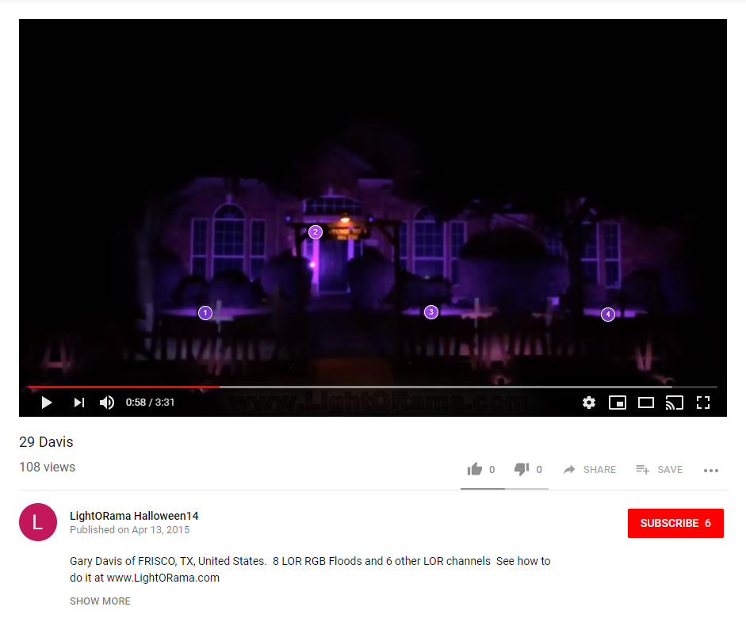

# LIFX Animation Recorder
See a light show on YouTube that you'd like to reproduce with your LIFX bulbs? This Chrome extension lets you record light animation data in a format you can replay with your bulbs using [LIFX Animator](https://github.com/galehouse5/LifxAnimator).

## How to use
These steps assume the Chrome extension is already installed.
1. Navigate to a video on YouTube. For example, [Gary Davis's animation of Katy Perry's Dark Horse](https://www.youtube.com/watch?v=_u2c9H4stVk).
2. Stop the video and seek to a frame that reveals the position of a light you'd like to record. Click on the light's position and a marker is created over it. Create markers for other lights you'd like to record. (Drag a marker to fine-tune its position or double click a marker to remove it.)

3. Seek to the start of the video (or whichever time you'd like the recording to start) and let the video play through (or stop the video when you'd like the recording to stop). When the video finishes playing (or is stopped), a sequence file containing light animation data is automatically downloaded and can be replayed using [LIFX Animator](https://github.com/galehouse5/LifxAnimator).

## Post processing
It's recommended that the recorded sequence be post processed, using an image editor, before it's played using [LIFX Animator](https://github.com/galehouse5/LifxAnimator). The color signals may contain distortion that results from the environment the light show was recorded in. Here are some examples:
- If a light source is obscured in the scene then you may have to record its reflection from surface, like brick, vinyl, or painted wood, and this will alter the color of the captured light.
- If a light source is in close proximity to another light source then your recording will contain a secondary signal caused by diffuse reflection.

Distortion can be reduced through careful marker placement and by using image filters in [paint.net](https://www.getpaint.net/), or your preferred image editor. In my experience, the "Levels", "Hue / Saturation", and "Posterize" filters are helpful.
